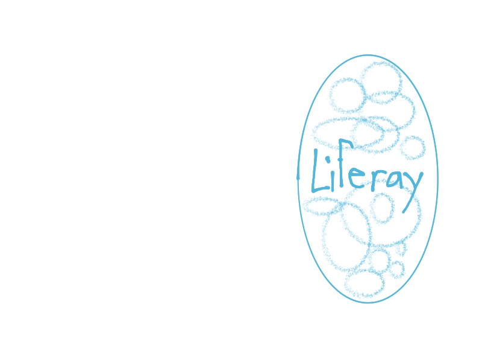
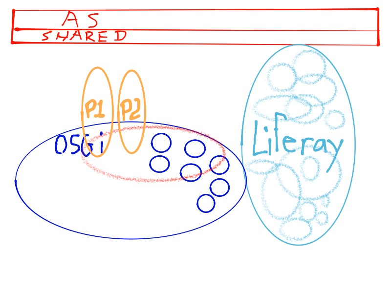
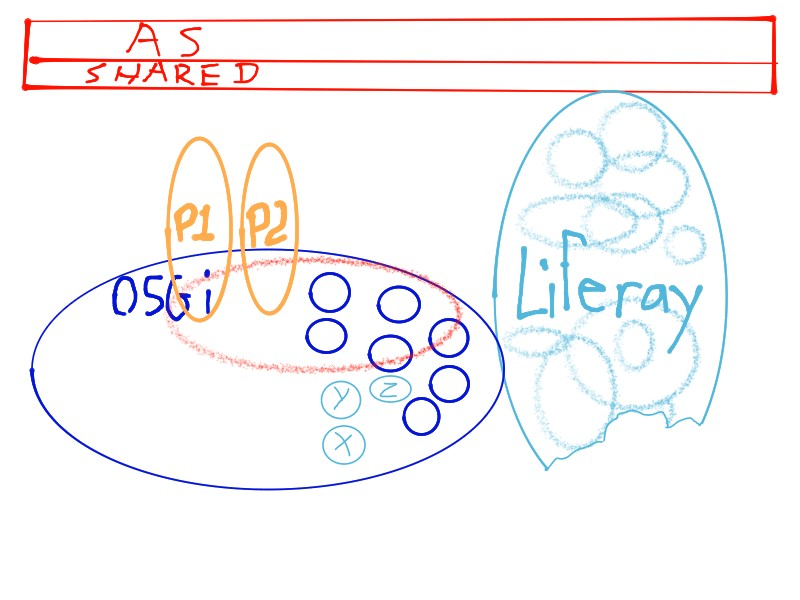
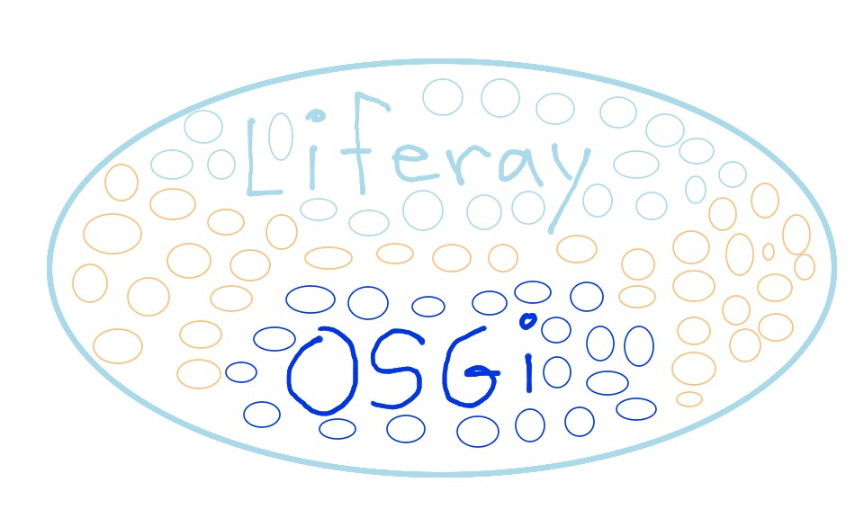

# icon:folder-open[] Modular Architecture
Raymond Augé <raymond.auge@liferay.com>
:icons: font
:title: Modular Architecture
:description: Presentation at North American Symposium 2014
:hashtags: #lrnas2014 #modulararchitecture
:twitter: @rotty3000

[big]**Liferay's Modular Architecture Explained**

|===
|**{author}**
|**icon:twitter[] {twitter} \| {hashtags}**
|===

////
Liferay Portal has always been a feature rich application with thousands of features and options resulting in billions of possible deployment scenarios. However, regardless of configuration, Liferay's core is all or nothing. We'll discuss the strategy used to redesign Liferay for modularity to improve quality and maintainability while allowing optional features to be completely removed or easily updated.
////

<<<

== icon:th-list[] Outline

icon:arrow-circle-left[] [big]**As it Was** +
icon:arrow-circle-down[] [big]**As it Is** +
icon:arrow-circle-right[] [big]**As it Shall Be** +
icon:arrow-circle-up[] [big]**Closing**

<<<

== icon:arrow-circle-left[] As it Was - Thousands of features

* Tightly coupled
* No clear boundaries
* All of nothing

<<<

== icon:arrow-circle-left[] As it Was - The ties that bind us...

image::resources/scrapNAS001_d.jpg[The ties that bind us..., 600, 400, align="center"]

* At the mercy of the app server
* Plugins are peers
* Start order issues
* Dependency issues
* Security issues

<<<

== icon:arrow-circle-left[] As it Was - Bridge Over Troubled Waters

image::resources/scrapNAS001_e.jpg[Bridge Over Troubled Waters, 600, 400, align="center"]

* Push as much as we can into _shared_
* App server idiosyncrasies
* Protect impls through indirection
* Hundreds of wrapper APIs
* Statics became the norm

<<<

== icon:arrow-circle-down[] As it Is - Take Back Control

image::resources/scrapNAS001_h.jpg[Take Back Control, 600, 400, align="center"]

* Create a plugin runtime under Liferay's control
* Implement infrastructure support
* Emulate some of the App Server features

<<<

== icon:arrow-circle-down[] As it Is - Don't turn your back

* Make sure that legacy apps (WARs) _can_ still work icon:angle-right[] provide for
** Auto conversion to OSGi (WAB)
** JSP support in OSGi
* In the process icon:angle-right[] Make a few enhancements
** Implement better dependency managment
** Publish SB services as OSGi services
** Eliminate SB service jar copying (go direct, don't need CLP)

<<<

== icon:arrow-circle-down[] As it Is - Tear Down the Walls

image::resources/scrapNAS001_k.jpg[Don't turn your back, 600, 400, align="center"]

* OSGi decoupling is primarily based on the service registry
* Simplify integration point logic through the Registry

<<<

== icon:arrow-circle-down[] As it Is - Tear Down the Walls

image::resources/scrapNAS001_l.jpg[Don't turn your back, 600, 400, align="center"]

* Registry opens the door for providers from any source
* Registry allows integration points to be placed anywhere

<<<

== icon:arrow-circle-down[] As it Is - Breaking it Down

* Refactoring core pieces into modules

<<<

== icon:arrow-circle-down[] As it Is - Breaking it Down

* Shrinking the monolith
* Bringing optionality

<<<

== icon:arrow-circle-right[] As it Shall Be - Strong Foundation

image::resources/scrapNAS001_o.jpg[Breaking it Down, 600, 400, align="center"]

* Core of essentials
* Increase re-use
* Smaller physical/memory footprint
* Easier configuration

<<<

== icon:arrow-circle-up[] Closing

* Monoliths are hard to maintain and have higher production costs.
* Modularity promotes isolation which promots re-use which promots innovation.
* Modularity reduces coupling which reduces maintenance costs which leads to satisifed users.

Liferay is doing whatever it can to increase productivity, reduce production and maintenance costs and to generally get out of your way while getting you to your goal faster.

<<<

== icon:comments[] Thank You!

* [big]**Questions?**