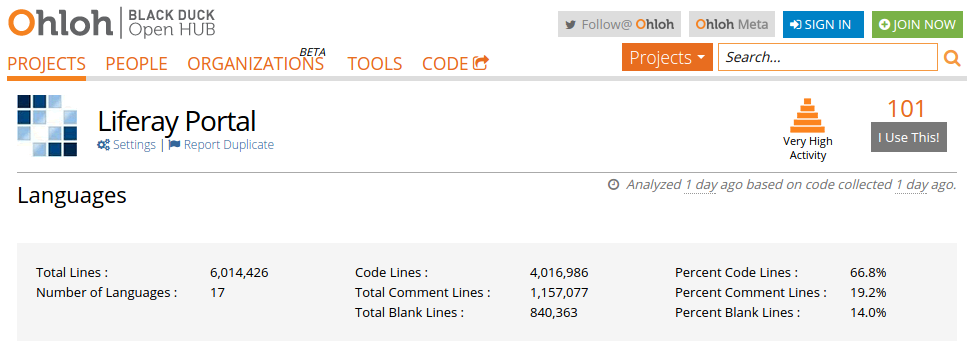

# icon:folder-open[] Case Study
Raymond Augé <raymond.auge@liferay.com>
:icons: font
:title: Case Study - Semantic Versioning A Large Existing Codebase
:description: Presentation at EclipseCon 2014
:hashtags: #eclipsecon #semver
:twitter: @rotty3000

[.background]
icon:folder-open[]

[.subtitle]
**Semantic Versioning A Large Existing Codebase**

|===
|EclipseCon 2014 +
|**{author}**
|**icon:twitter[] {twitter} \| {hashtags}**
|===

<<<

== icon:th-list[] Outline

[.background]
icon:th-list[]

[cols="2*"]
|===
|icon:chevron-sign-right[] The Goal
|icon:gears[] The Project
|icon:warning-sign[] The Problem
|icon:puzzle-piece[] The solution
|icon:key[] Semantic Versioning
|icon:wrench[] Tools
|icon:magic[] BND
|icon:expand-alt[] Our Enhancements
|icon:exclamation[] The conclusion
|
|===

<<<

== icon:chevron-sign-right[] The Goal

[.background]
icon:chevron-sign-right[]

|===
|Improve Code Quality icon:exclamation[]
|Increase Developer Joy icon:exclamation[]
|===

<<<

== icon:gears[] The Project

[.background]
icon:gears[]

|===
|**Liferay Portal** project is a large open source application
|A large community of users and contributors
|===

<<<

== icon:warning-sign[] The problem

[.background]
icon:warning-sign[]

|===
|**Product** versioning scheme
a|* **Minor** Releases (6.1.0 icon:arrow-right[] 6.2.0)
** **Binary patch** security hot-fixes
** Collective **Fix-Packs**
** No incremental feature updates
** API Breaking changes (**hopefully not!**)
|===

<<<

== icon:warning-sign[] The problem

[.background]
icon:warning-sign[]

|===
|**Product** versioning scheme
a|* **Major** Releases (6.2.0 icon:arrow-right[] 7.0.0)
** More than **1 year** between releases
** Monolithic upgrades
** API Breaking changes (**guaranteed!** Best effort to know which!)
* Tight coupling rampant across features
//|icon:arrow-right[] **Continuous Release?** Impossible!
//|icon:arrow-right[] There is far too much risk in starting from scratch.
|===

<<<

== icon:puzzle-piece[] The solution

[.background]
icon:puzzle-piece[]

=== icon:lightbulb[] To a large degree resolving these issues begins with **API Management**.

<<<

== icon:puzzle-piece[] The solution

[.background]
icon:puzzle-piece[]

|===
|Controlled evolution demonstrates **API Reliability**
|Ability to resolve implementation issues while maintaining compatibility
demonstrates **API Stability**
|Though there are no measures of **API Productivity**, it's clear that good
APIs improve developer productivity
|===

<<<

== icon:puzzle-piece[] The solution

[.background]
icon:puzzle-piece[]

|===
|**Reliability**, **Stability**, **Productivity** make happy Developers / Users / Customers!
|===

<<<

== icon:key[] Semantic Versioning

[.background]
icon:key[]

|===
|icon:arrow-right[] Achieve **programmatic detection** of API changes
|icon:arrow-right[] Provide developers with tools to ease the learning curve
|
|Artifact granularity is not sufficient when size exceed some inordinate number of APIs.
|===

<<<

== icon:key[] Semantic Versioning

[.background]
icon:key[]

|===
|Using the **OSGi Alliance Semantic Versioning** white paper definition
|http://www.osgi.org/wiki/uploads/Links/SemanticVersioning.pdf
|The unit of granularity is **package**.
|icon:arrow-right[] However, implementing Semantic Versioning at the scale of this project is a significant amount of work!
|===

<<<

== icon:wrench[] Tools

[.background]
icon:wrench[]

|===
|icon:arrow-right[] The key to **Semantic Versioning** is tooling.
|Humans are biased, error prone
|Semantic Versioning is boring and tedious
|Let machines do the work
|There aren't many well known tools.
|icon:star[] **Fortunately**, the most well known one is **FANTASTIC** (and can
provide even more useful information than it currently lets on.)
|===

<<<

== icon:wrench[] Tools

[.background]
icon:wrench[]

=== With proper tooling it's simple to adopt Semantic Versioning **incrementally**!

<<<

== icon:magic[] BND

[.background]
icon:magic[]

[quote, Peter Kriens, http://www.aqute.biz/Bnd]
"bnd is the Swiss army knife of OSGi, it is used for creating and working with OSGi bundles. Its primary goal is take the pain out of developing bundles."

icon:arrow-right[] http://www.aqute.biz/Bnd/Bnd (the library) +
icon:arrow-right[] http://bndtools.org/ (a complete OSGi Suite for Eclipse)

<<<

== icon:magic[] BND - Baseline

[.background]
icon:magic[]

[quote, Peter Kriens, http://www.aqute.biz/Bnd/Versioning]
"Baselining compares the public API of a bundle with the public API of another bundle."

<<<

== icon:magic[] BND - Baseline

[.background]
icon:magic[]

**Invocation**

----
java -jar biz.aQute.bnd-latest.jar baseline -d ./biz.aQute.bnd-latest.jar /other/bnd.jar
----

**Output**

----
===============================================================
  biz.aQute.bnd 2.3.0.20140315-151701-2.2.0.20131017-210830
===============================================================
  Package                                            Delta      New        Old        Suggest    If Prov.
  aQute.bnd.build                                    MINOR      2.3.0      2.2.0      ok         - <1>
  aQute.bnd.header                                   MINOR      1.3.0      1.2.0      ok         -
  aQute.bnd.osgi                                     MINOR      2.2.0      2.1.3      ok         -
  aQute.bnd.service.classparser                      ADDED      1.0.0      -          ok         - <2>
  aQute.bnd.service.extension                        ADDED      1.0.0      -          ok         -
  aQute.bnd.service.phases                           ADDED      1.0.0      -          ok         -
  aQute.bnd.service.repository                       MINOR      1.3.0      1.1.0      ok         -
  aQute.bnd.service.url                              MINOR      1.2.0      1.1.0      ok         -
  aQute.bnd.version                                  MINOR      1.1.0      1.0.0      ok         -
----

<1> Easily recognize degree of version change
<2> Detects all types of change

<<<

== icon:magic[] BND

[.background]
icon:magic[]

icon:arrow-right[] The project started with no versioning, and with developers ignorant
about Semantic Versioning.

BND's existing information does not provide enough detail for less experienced
developers to understand how things get broken.

<<<

== icon:magic[] BND

[.background]
icon:magic[]

Internally BND performs exceptionally detailed API analytics, not exposed in it's
default output

The project needed that information icon:exclamation[]

icon:arrow-right[] None of our code is OSGi aware. BND is designed to operate
with OSGi bundles.

<<<

== icon:magic[] BND

[.background]
icon:magic[]

Can BND still be used when the code isn't OSGi ready icon:question[]

icon:arrow-right[] **Yes!** Even the most basic BND configuration is useful

----
Bundle-SymbolicName: ${bundle.name}
Bundle-Version: ${bundle.version}
Export-Package: *
Import-Package: *
----

<<<

== icon:magic[] BND - Creating Jars

[.background]
icon:magic[]

[cols="2*"]
|===
2+a|Consider this simple directory structure
----
/bnd.bnd
/bnd.jar
/src/main/java/com/test/Fee.java
/src/main/java/com/test/IFoo.java
----
a|[source,java]
Fee.java
----
package com.test;
public class Fee {
  public void doFee() {}
  public void doFee2(IFoo foo) {}
}
----
a|[source,java]
IFoo.java
----
package com.test;
public interface IFoo {
  public void doFoo();
}
----
2+a|[source]
bnd.bnd
----
Bundle-SymbolicName: a
Bundle-Version: 1.0.0
Export-Package: *
Import-Package: *
Include-Resource: build/classes
-output: build/libs/${Bundle-SymbolicName}.jar
----
|===

<<<

== icon:magic[] BND - Creating Jars

[.background]
icon:magic[]

|===
a|Compile
----
mkdir -p build/classes
javac -d build/classes $(find . -name "*.java")
rsync -aq --exclude '*.java' src/main/java/* build/classes/
----
a|Jar with BND
----
mkdir -p build/libs
java -jar bnd.jar bnd -p bnd.bnd
----
|===

<<<

== icon:magic[] BND - Creating Jars

[.background]
icon:magic[]

|===
|Result
a|[source]
build/libs/a.jar!MANIFEST.MF
----
Manifest-Version: 1.0
Bnd-LastModified: 1395117308444
Bundle-ManifestVersion: 2
Bundle-Name: a
Bundle-SymbolicName: a
Bundle-Version: 1.0.0
Created-By: 1.7.0_51 (Oracle Corporation)
Export-Package: com.test;version="1.0.0"
Include-Resource: build/classes
Require-Capability: osgi.ee;filter:="(&(osgi.ee=JavaSE)(version=1.7))"
Tool: Bnd-2.3.0.20140315-151701
----
|===

<<<

== icon:magic[] BND - Baseline

[.background]
icon:magic[]

|===
|**Baseline** is the operation of comparing one jar to a previous version of the
same jar in order to analyze for API changes.
|The base case
a|----
java -jar bnd.jar baseline build/libs/a.jar repo/a-latest.jar
===============================================================
  a 1.0.0-1.0.0
===============================================================
----
|===

<<<

== icon:magic[] BND - Baseline

[.background]
icon:magic[]

|===
a|[source,java]
IFoo.java
----
package com.test;
public interface IFoo {
  public void doFoo();
  public void doFoo2(); <1>
}
----

<1> Added a new method
|Produces
a|[source]
----
java -jar bnd.jar baseline -d build/libs/a.jar repo/a-latest.jar
===============================================================
* a 1.0.0-1.0.0 suggests 2.0.0
===============================================================
  Package                                            Delta      New        Old        Suggest    If Prov.
* com.test                                           MAJOR      1.0.0      1.0.0      2.0.0      1.0.0<1>
----

<1> Adding a method to an interface is a `MAJOR` change
|===

<<<

== icon:magic[] BND - Baseline

[.background]
icon:magic[]

|===
a|[source,java]
IFoo.java
----
package com.test;
@aQute.bnd.annotation.ProviderType <1>
public interface IFoo {
  public void doFoo();
  public void doFoo2();
}
----

<1> Added the `@ProviderType` annotation
|Produces
a|[source]
----
java -jar bnd.jar baseline -d build/libs/a.jar repo/a-latest.jar
===============================================================
* a 1.0.0-1.0.0 suggests 1.1.0
===============================================================
  Package                                            Delta      New        Old        Suggest    If Prov.
* com.test                                           MINOR      1.0.0      1.0.0      1.1.0      - <1>
----

<1> The change is now `MINOR` and suggested version reflects this
|===

<<<

== icon:magic[] BND - Baseline

[.background]
icon:magic[]

|===
|Baseline indicates that the package's version still needs to be properly assigned.
|To assign a proper version create a text file called `packageinfo` in the package directory.
a|[source]
packageinfo
----
version 1.1.0
----
|Rebuild and baseline
a|[source]
----
java -jar bnd.jar baseline -d build/libs/a.jar repo/a-latest.jar
===============================================================
* a 1.0.0-1.0.0 suggests 1.1.0 <2>
===============================================================
  Package                                            Delta      New        Old        Suggest    If Prov.
  com.test                                           MINOR      1.1.0      1.0.0      ok         - <1>
----

<1> Note the package state is no longer _dirty_.
<2> Baseline now suggests that the library version be increased to `1.1.0` but
refrain from doing so until the lib is ready to release.
|===

<<<

== icon:expand-alt[] Our Enhancements

[.background]
icon:expand-alt[]

|===
|Our team wrapped BND operations for use in ant and gradle.
|This allowed us deeper access to the extensive information BND has
available.
|Different reporting levels allow developers to choose what most
suits their needs.
|Baseline reporting is automatically enabled for all builds and uses a remote
repository for zero configuration setup.
|Optionally, persisted reports can be reviewed later or used by things like CI
to fail builds, etc.
|===

<<<

== icon:expand-alt[] Our Enhancements

[.background]
icon:expand-alt[]

=== Case #1

----
  PACKAGE_NAME                                       DELTA      CUR_VER    BASE_VER   REC_VER    WARNINGS
= ================================================== ========== ========== ========== ========== ==========
* com.liferay.portal.kernel.monitoring.statistics    MAJOR      6.2.0      6.2.0      7.0.0      VERSION INCREASE REQUIRED
  >   class      com.liferay.portal.kernel.monitoring.statistics.DataSampleThreadLocal
    -   implements java.lang.Cloneable <1>
    >   method     clone() <2>
      +   access     protected
    +   method     initialize() <3>
      +   access     static
----

<1> Interface removed
<2> Method signature changed from public to protected
<3> Static method added

<<<

== icon:expand-alt[] Our Enhancements

[.background]
icon:expand-alt[]

=== Case #2

----
  PACKAGE_NAME                                       DELTA      CUR_VER    BASE_VER   REC_VER    WARNINGS
= ================================================== ========== ========== ========== ========== ==========
* com.liferay.portal.kernel.template                 MAJOR      6.3.0      6.2.0      7.0.0      VERSION INCREASE REQUIRED
  <   class      com.liferay.portal.kernel.template.BaseTemplateHandler <1>
    +   method     getTemplatesHelpContent(java.lang.String)
      +   return     java.lang.String
    +   annotated  aQute.bnd.annotation.ProviderType <2>
  >   class      com.liferay.portal.kernel.template.TemplateHandlerRegistryUtil
    -   method     <init>() <3>
[snip]
----

<1> Abstract class
<2> Annotated as `@ProviderType`
<3> Deletion of a method is always `MAJOR`

<<<

== icon:expand-alt[] Our Enhancements

[.background]
icon:expand-alt[]

=== Case #2 (cont')

----
  PACKAGE_NAME                                       DELTA      CUR_VER    BASE_VER   REC_VER    WARNINGS
= ================================================== ========== ========== ========== ========== ==========
* com.liferay.portal.kernel.template                 MAJOR      6.3.0      6.2.0      7.0.0      VERSION INCREASE REQUIRED
[snip]
  <   interface  com.liferay.portal.kernel.template.TemplateHandler <1>
    +   method     getTemplatesHelpContent(java.lang.String) <2>
      +   access     abstract
      +   return     java.lang.String
    +   annotated  aQute.bnd.annotation.ProviderType <3>
  -   interface  com.liferay.portal.kernel.template.TemplateHandlerRegistry
[snip]
  -   version    6.2.0
  +   version    6.3.0 <4>
----

<1> Interface is modified
<2> Method is added
<3> Because it's `@ProviderType` change is `MINOR`
<4> Version had previously been increased, but now it's `MAJOR`

== icon:exclamation[] The conclusion

[.background]
icon:exclamation[]

icon:arrow-right[] Did we achieve our goals?

=== Improve Code Quality icon:exclamation[]

|===
|More quickly identify problem areas
a|* _Catch all_ packages suffer too much change (too many classes affected): how
should classes be slit up logically
* Over embellished bug fixes: never mix bug fixes and API changes
* Bad design decisions are more obvious
|===

<<<

== icon:exclamation[] The conclusion

[.background]
icon:exclamation[]

icon:arrow-right[] Did we achieve our goals?

=== Improve Code Quality icon:exclamation[]

|===
|Packages which don't change over time are either very stable or unused
|icon:arrow-right[] **stable**: _Isolate and congratulate the maintainer_
|icon:arrow-right[] **unused**: _Delete without prejudice_
|Packages which do change frequently are possible problem areas, or need to be
isolated into individual modules
|===

<<<

== icon:exclamation[] The conclusion

[.background]
icon:exclamation[]

icon:arrow-right[] Did we achieve our goals?

=== Increase Developer Joy icon:exclamation[]

|===
|Developers are more accountable (oddly this makes other developers happy)
|Ability to produce **100% accurate reports of API change** across the entire
product: means they have a reliable source of information
|Just like automated tests, automated API change detection makes developers feel
more confident
|Increased enthusiasm evident among our developers
|===

<<<

== icon:power-off[] Thank You!

[.background]
icon:power-off[]

[#footer]
**icon:twitter[] {twitter} | {hashtags}**
